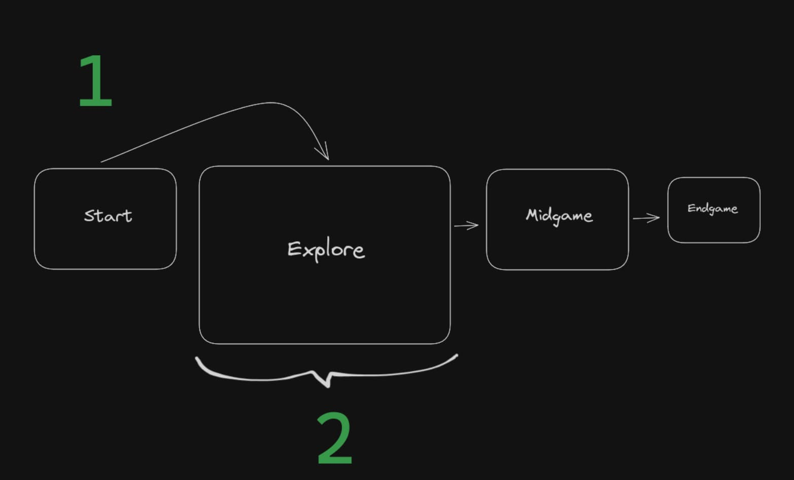

# Swipe for Future Scenarios

> Learn how to create scenarios, and explore features of the game engine

## Scenarios

Swipe for Future allows for a wide range of possible scenarios.

**TODO: Add examples to make this document less abstract and more useful**

---

## Stats

Scenarios can have one or more stats, visible at the top of the game UI. Stats are numerical variables that influence the simulation and gameplay. Each stat can have a `min` and `max` value and will always be capped to remain within the valid range.

### Add custom icons for stats

1.  Find SVG icons you like on <https://icones.js.org>.
2.  Copy the SVG as a data URL (base64 encoded string).
3.  Add icons to [icons.ts](../content/content-utils/icons.ts)
4.  In your scenario, import the icons you want. You can customise the size to give all icons a similar size.

---

## Cards

Cards are the basic building blocks of scenarios. Each turn, the game picks one of the available cards based on the game state. Every card can control how and when it is shown, by specifying one or more `WorldQuery`.

When the game selects a card, it first gets all the cards that are available at that time.

### Defining when a card is available with one or more `WorldQuery`

The basic idea is to make a card available only when some conditions are met. It can either be when a game state variable is within a certain range, like between`20` and `55`. It can also be when specific variables have been set, allowing for more advanced conditions.

#### There are two ways to use define when a card should be available:

1. If you want several conditions to all be met at the same time, you can define a `WorldQuery` that is matching multiple variables. The card will only be available when everything in this `WorldQuery` is matching.
2. If you want different possible conditions, you can add multiple world queries to a card. As long as at least one of the world queries are matching the current game state, the card will be available to the player.

### Swiping and making game progression

When the player swipes a card either to the left or right, this updates the game state by applying the corresponding `CardAction`. Each `CardAction` can change the game state based on one or more `GameWorldModifier`s.

### `CardAction`s can have several types of `GameWorldModifier`s:

#### `add`: Increase or decrease any game state variable by a given number.

Positive values will increment, negative values decrement. This is especially useful to update regular stats which shows up in the game UI. It can also be used to update other variables that are hidden to the player.

#### `set`: Set a game state variable to a specific value.

This is useful for special variables behind the scenes that control which other cards are available. By setting variables to either `1` or `0`, this can be used as special boolean flags to control game progression.

#### `replace`: Reset the game state to the default game state when the scenario started.

This can be useful to create a loop to let the player restart after losing the scenario.

### Connecting specific cards with `next`

In some cases, you might want to connect specific cards together, for example to show a specific card directly after the player takes an action. This can be achieved by adding a `next` property to the `CardAction` (for example for `left`). There are content utils available to simplify linking of cards, to automatically show and hide them in the right order.

**TODO: Make this section clearer. What content-utils to use? What's important to think about?**

---

## Card groups

It's possible to group cards together, for example to make them all available at the same time. This can make it easier to structure a scenario to have distinct sections.

In the diagram:

1. In the `Start` card group, some card(s) uses the `set` modifier to unlock the next card group, `Explore`. Until this happens, only the cards from the `Start` card group are available in the game.
2. All cards in the `Explore` card group has a `WorldQuery` that makes them show up only when a specific flag from the `Start` card group has been set. The same logic can be applied to the later card groups `Midgame` and `Endgame` too.
